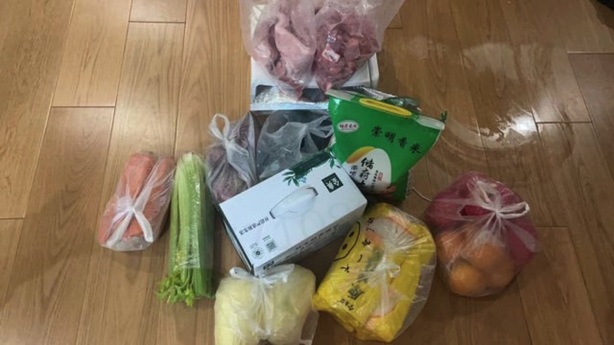
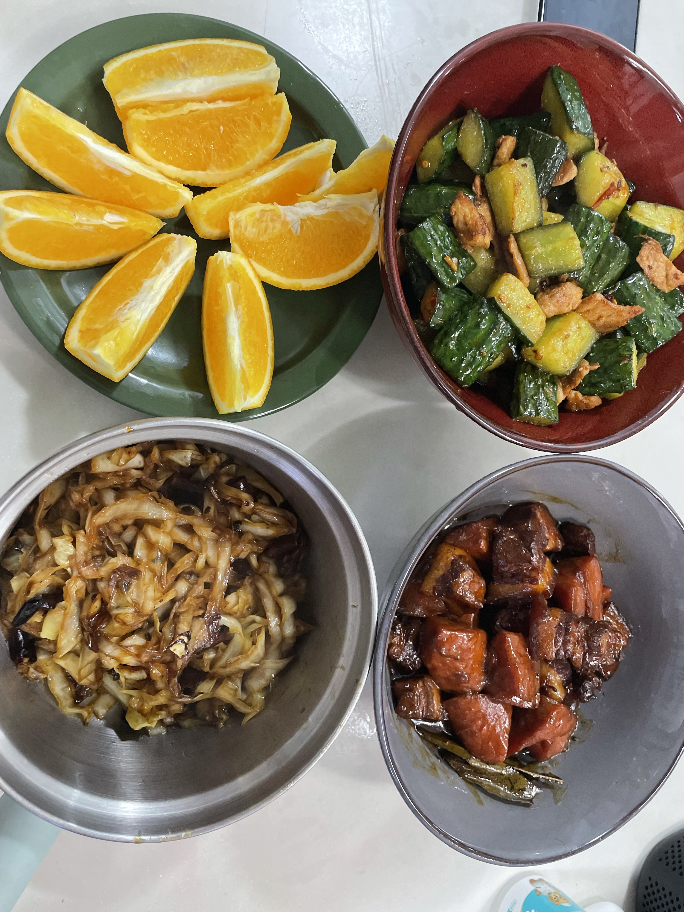

# shanghai-covid19-hp-up-up

2022年3月起，上海新冠疫情爆发。

由于准备不充分且隔离时间长，很多小伙伴没有充足的生活物资。

而这时，有些公司挺身而出，给公司员工送来了物资，也带来了温暖。

此仓库用于记录那些在困难时期，想方设法为员工提供物资、解决困难的公司。

在冰冷的疫情下，注入一丝温暖。

贡献指南
---
更新此文件时，请提供简要的描述以及物资照片。

名单列表
---

|公司名字|物资送达时间|物资描述|物资照片|厨艺展示(可选)
|:---:|:---:|:---:|:---:|:---:|
|[美团](https://about.meituan.com/home)|2022.4.11|大米、猪肉、牛奶、蔬菜、水果|||
